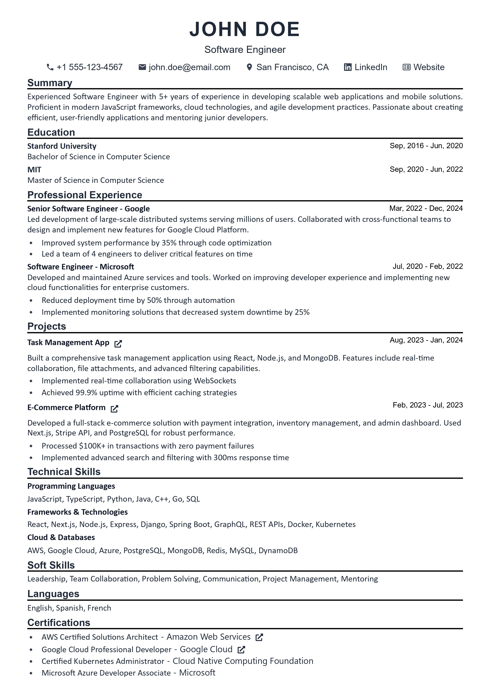

# Profocto 🚀

<div align="center">   
  
  
  ### **Profile Élegante - Create Professional Resumes in Minutes**
  
  A modern, feature-rich resume builder with real-time editing, multiple templates, and seamless cloud sync.
  
  [](https://profocto.tech)
  [](https://github.com/NiranjanKumar001/Profocto)
  [](LICENSE)
  [](https://nextjs.org/)
  [](https://www.typescriptlang.org/)
</div>

---

## � Screenshots

<div align="center">
  
  <p><em>Modern, elegant interface for creating professional resumes</em></p>
</div>

<div align="center">
  
  <p><em>Professional resume templates with real-time editing</em></p>
</div>

## �🚀 Live Demo

**🌐 Try it now:** [https://profocto.tech](https://profocto.tech)

Create professional resumes in minutes with our intuitive, modern interface.

## ✨ Key Features

### 🎨 **Design & Templates**
- **5 Professional Templates** - Classic, Modern, and specialized layouts for different industries
- **Drag & Drop Sections** - Reorder resume sections with intuitive drag-and-drop (desktop & mobile optimized)
- **Nested Drag & Drop** - Reorganize individual items within sections (education, experience, projects, skills, etc.)
- **Modern UI/UX** - Clean, elegant design with smooth Framer Motion animations
- **Fully Responsive** - Optimized for desktop, tablet, and mobile devices with lazy-loading for performance
- **Custom Section Titles** - Rename any section to match your preferences

### 🔐 **Authentication & Data**
- **Secure Google OAuth** - Quick and safe sign-in with NextAuth.js
- **Real-time Database** - Powered by Convex for instant cloud synchronization
- **Auto-save** - Local storage + cloud backup ensures you never lose progress
- **Multi-device Sync** - Access your resumes from any device seamlessly

### ⚡ **User Experience**
- **Live Preview** - See changes instantly as you type
- **Editable Everything** - All sections, titles, and content fully customizable
- **Mobile-Optimized Editing** - Touch-friendly controls with visible drag handles
- **PDF Export** - Download professional PDFs with proper formatting
- **Skeleton Loaders** - Smooth loading states with staggered animations
- **Performance Optimized** - Lazy section rendering for buttery-smooth mobile scrolling

### 🛠️ **Advanced Features**
- **Rich Content Support** - Add links, achievements, descriptions to all sections
- **Date Range Components** - Smart date formatting (e.g., "Jan 2023 - Present")
- **Profile Picture Support** - Upload and display professional photos (Template 5)
- **Social Media Links** - Integrate LinkedIn, GitHub, Portfolio, and more
- **Dynamic Skills** - Categorize skills (Technical, Soft Skills, Languages)
- **Awards & Certifications** - Showcase your achievements and credentials
- **SEO Optimized** - Server-side rendering for better discoverability
- **Print Optimization** - Clean, professional print layouts without UI elements

## 🛠️ Tech Stack

### **Core Technologies**

| **Category** | **Technology** | **Version** | **Purpose** |
|--------------|----------------|-------------|-------------|
| **Framework** | Next.js | 15.x | React framework with App Router, server-side rendering |
| **Frontend** | React | 18.x | Component-based UI library |
| **Language** | TypeScript | 5.x | Type-safe JavaScript development |
| **Database** | Convex | Latest | Real-time database with automatic sync |
| **Authentication** | NextAuth.js | 4.x | Secure authentication with OAuth providers |

### **Styling & UI**

| **Technology** | **Purpose** |
|----------------|-------------|
| **Tailwind CSS** | Utility-first CSS framework for rapid styling |
| **Framer Motion** | Animation library for smooth transitions and interactions |
| **React Icons** | Comprehensive icon library |
| **Custom Components** | Reusable UI components built from scratch |

### **Development & Build Tools**

| **Tool** | **Purpose** |
|----------|-------------|
| **ESLint** | Code linting and formatting |
| **PostCSS** | CSS processing and optimization |
| **Autoprefixer** | Automatic CSS vendor prefixing |
| **TypeScript Compiler** | Type checking and compilation |

### **Deployment & Hosting**

| **Service** | **Purpose** |
|-------------|-------------|
| **Vercel** | Frontend hosting and deployment |
| **Convex Cloud** | Database hosting and real-time sync |
| **Google OAuth** | Authentication service |

### **Key Dependencies**

```json
{
  "name": "profocto",
  "version": "0.3.0",
  "dependencies": {
    "next": "^15.5.4",
    "react": "^18.3.1",
    "typescript": "^5.6.3",
    "convex": "^1.17.6",
    "next-auth": "^4.24.11",
    "framer-motion": "^12.4.3",
    "tailwindcss": "^3.4.14",
    "@dnd-kit/core": "^6.1.0",
    "@dnd-kit/sortable": "^8.0.0",
    "react-icons": "^5.3.0"
  }
}
```

### **Architecture Highlights**

- **App Router**: Modern Next.js 15 routing with React Server Components
- **Real-time Database**: Convex provides instant data synchronization across devices
- **Type Safety**: Full TypeScript implementation with strict type checking
- **Component Architecture**: Modular, reusable components with clear separation of concerns
- **Drag & Drop**: @dnd-kit for accessible, performant drag-and-drop functionality
- **Responsive Design**: Mobile-first approach with Tailwind CSS utility classes
- **Performance Optimized**: 
  - Lazy section rendering with IntersectionObserver
  - Content-visibility CSS for off-screen optimization
  - GPU-accelerated scrolling with translateZ(0)
  - Dynamic imports for code splitting
- **Context API**: Efficient state management for resume data and section titles

## 🎯 Quick Start

### 👤 **For Users**
1. 🌐 **Visit**: [Profile Élegante](https://profocto.tech)
2. 🔐 **Sign In**: Use your Google account for secure authentication
3. � **Choose Template**: Select from professional resume layouts
4. ✏️ **Fill Information**: Add your personal details, experience, skills
5. �️ **Live Preview**: See changes in real-time as you edit
6. 📥 **Export**: Download your resume as PDF or share online

### 💻 **For Developers**

#### **Prerequisites**
- Node.js 18+ 
- npm or yarn
- Git
- Google OAuth credentials (for auth)
- Convex account (for database)

#### **Local Development Setup**

```bash
# 1. Clone the repository
git clone https://github.com/NiranjanKumar001/Profocto.git
cd Profocto

# 2. Install dependencies
npm install

# 3. Set up environment variables
# Create .env.local file and add the following:
# NEXTAUTH_SECRET=your-secret-key
# NEXTAUTH_URL=http://localhost:3000
# GOOGLE_CLIENT_ID=your-google-client-id
# GOOGLE_CLIENT_SECRET=your-google-client-secret
# NEXT_PUBLIC_CONVEX_URL=https://wooden-corgi-542.convex.cloud
# CONVEX_DEPLOY_KEY=your-convex-deploy-key

# 4. Set up Convex database
npx convex dev

# 5. Start development server
npm run dev
```

#### **Available Scripts**

```bash
npm run dev          # Start development server
npm run build        # Build for production
npm run start        # Start production server
npm run lint         # Run ESLint
```

#### **Development Workflow**
1. Make your changes
2. Test locally with `npm run dev`
3. Run `npm run build` to ensure production build works
4. Commit and push your changes

Want to contribute? Check out our [Contributing Guide](CONTRIBUTING.md)

## � Environment Variables

Create a `.env.local` file in the root directory with the following variables:

```bash
# Authentication (Required)
NEXTAUTH_SECRET=your-secret-key-here
# For local development:
NEXTAUTH_URL=http://localhost:3000
# For production:
# NEXTAUTH_URL=https://profocto.tech

# Google OAuth (Required)
GOOGLE_CLIENT_ID=your-google-oauth-client-id
GOOGLE_CLIENT_SECRET=your-google-oauth-client-secret  

# Convex Database (Required)
NEXT_PUBLIC_CONVEX_URL=https://wooden-corgi-542.convex.cloud
CONVEX_DEPLOY_KEY=your-convex-deploy-key
```

### **How to Get These Values:**

#### **Google OAuth Setup**
1. Go to [Google Cloud Console](https://console.cloud.google.com/)
2. Create a new project or select existing one
3. Enable Google+ API
4. Go to "Credentials" → "Create Credentials" → "OAuth 2.0 Client IDs"
5. Set authorized redirect URIs: 
   - `http://localhost:3000/api/auth/callback/google` (for development)
   - `https://profocto.tech/api/auth/callback/google` (for production)

#### **Convex Database Setup**
1. Sign up at [Convex](https://convex.dev/)
2. Create a new project  
3. Copy the deployment URL and deploy key from dashboard
4. Run `npx convex dev` to sync your schema
5. **Note**: The current deployment uses `wooden-corgi-542.convex.cloud` - you'll need your own Convex deployment

#### **NextAuth Secret**
```bash
# Generate a secure secret
openssl rand -base64 32
```

## 🏗️ Project Structure

```
Profocto/
├── 📁 app/                      # Next.js 15 App Router
│   ├── api/auth/               # NextAuth.js authentication routes
│   ├── builder/[id]/           # Resume builder page with dynamic routing
│   ├── templates/              # Template selection page
│   ├── layout.tsx              # Root layout with providers
│   └── page.tsx                # Landing page
├── 📁 components/              # Reusable React components
│   ├── 🔐 auth/               # Auth components (modals, logout loader)
│   ├── 📝 form/               # Form sections (Education, Experience, Skills, etc.)
│   ├── 👀 preview/            # Resume templates (Preview, TemplateTwo-Five)
│   ├── 🎨 ui/                 # UI utilities (skeletons, nav, badges)
│   └── utility/               # Helper components (DateRange, print utilities)
├── 📁 contexts/               # React Context API
│   ├── ResumeContext.tsx      # Global resume data state
│   └── SectionTitleContext.js # Custom section title management
├── 📁 lib/                    # Utility functions
│   ├── convex-adapter.ts      # NextAuth Convex adapter
│   ├── convex-client.ts       # Convex client configuration
│   └── utils.ts               # Helper utilities
├── 📁 public/                 # Static assets
│   └── assets/                # Images, logos, templates
├── 📁 types/                  # TypeScript definitions
│   ├── resume.ts              # Resume data types
│   └── *.d.ts                 # Module declarations
├── 📁 convex/                 # Convex backend
│   ├── schema.ts              # Database schema
│   ├── resume.ts              # Resume CRUD operations
│   └── auth.ts                # Authentication logic
├── 📄 middleware.ts           # Next.js middleware for auth
├── 📄 tailwind.config.ts      # Tailwind CSS configuration
└── 📄 next.config.mjs         # Next.js configuration
```

## 🚀 Deployment

This project is optimized for deployment on **Vercel**:

1. Fork this repository
2. Connect your GitHub account to Vercel
3. Import the project
4. Add your environment variables
5. Deploy!

## 🤝 Contributing

We love contributions! Whether you're fixing bugs, adding features, or improving documentation, your help is appreciated.

Please read our [Contributing Guide](CONTRIBUTING.md) for detailed guidelines.

### 🎯 Ways to Contribute:
- 🐛 **Report bugs** - Help us identify and fix issues
- 💡 **Suggest features** - Share ideas for new functionality
- 🎨 **Improve UI/UX** - Enhance design and user experience
- 📚 **Update docs** - Improve README, comments, and guides
- ⚡ **Optimize performance** - Make the app faster and smoother
- 🔧 **Fix issues** - Pick up open issues and submit PRs
- 🧪 **Add tests** - Improve code quality and reliability
- 🌐 **Translations** - Help make Profocto accessible worldwide

### � Quick Contribution Steps:
1. Fork the repository
2. Create a feature branch (`git checkout -b feature/amazing-feature`)
3. Make your changes and commit (`git commit -m 'feat: add amazing feature'`)
4. Push to your branch (`git push origin feature/amazing-feature`)
5. Open a Pull Request with a clear description

**First-time contributor?** Look for issues labeled `good first issue` to get started!

## 📝 License

This project is licensed under the MIT License - see the [LICENSE](LICENSE) file for details.

## � Support & Community

- 🐛 **Found a bug?** [Open an issue](https://github.com/NiranjanKumar001/Profocto/issues/new)
- 💡 **Have an idea?** [Start a discussion](https://github.com/NiranjanKumar001/Profocto/discussions)
- 📧 **Need help?** Check existing issues or create a new one
- ⭐ **Like the project?** Give it a star and share with others!

## 🙏 Acknowledgments

Special thanks to these amazing technologies and communities:

- **[Next.js](https://nextjs.org/)** - The React framework that powers Profocto
- **[Convex](https://convex.dev/)** - Real-time backend as a service
- **[Vercel](https://vercel.com/)** - Seamless deployment and hosting
- **[Tailwind CSS](https://tailwindcss.com/)** - Utility-first CSS framework
- **[Framer Motion](https://www.framer.com/motion/)** - Production-ready animation library
- **[dnd-kit](https://dndkit.com/)** - Modern drag & drop toolkit
- **[NextAuth.js](https://next-auth.js.org/)** - Authentication for Next.js
- **[React Icons](https://react-icons.github.io/react-icons/)** - Icon library
- All our amazing contributors! 🎉

## 📊 Project Stats


---

<div align="center">
  
### 💖 **Built with passion by [NiranjanKumar001](https://github.com/NiranjanKumar001)**

**Love Profocto? Show your support!**

⭐ Star this repo | 🍴 Fork it | 📢 Share with friends

<sub>Made with Next.js, TypeScript, and lots of ☕</sub>

</div>
